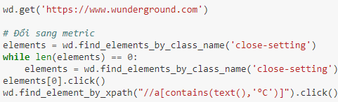
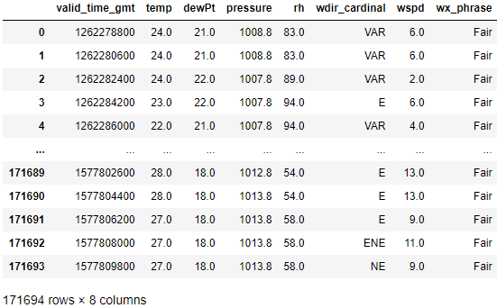

# Đồ án khoa học dữ liệu

<pre>
MSSV: 1712358   Họ và tên: Nguyễn Minh Đức  
MSSV: 1712379   Họ và tên: Đặng Thành Duy
</pre>

Phân công công việc:

|Thành viên|Công việc|
|----------|---------|
|Nguyễn Minh Đức|Phân tích dữ liệu, build model DNN, train model logistic, bình luận, dự đoán|
|Đặng Thành Duy|Thu thập dữ liệu API, crawl dữ liệu qua HTML, tiền xử lý và xử lý dữ liệu,  train model linear, train model logistic, dự đoán|

# Chủ đề: Dự báo thời tiết

## I.  Câu hỏi:

**Dự đoán thời tiết trong tương lai gần (nhiệt độ, trời có mưa không) dựa vào các thông số thời tiết (nhiệt độ, độ ẩm, tốc độ gió,...) của những ngày trước đó.**

Cụ thể: dự đoán `nhiệt độ trung bình`, `nhiệt độ thấp nhất`, `nhiệt độ cao nhất`, `tỉ lệ có mưa` và dự đoán `có mưa hay không` của 1 ngày dựa vào các thông số của 2 ngày trước đó bao gồm:  
  - `nhiệt độ trung bình`, `nhiệt độ thấp nhất`, `nhiệt độ cao nhất`
  - `điểm sương trung bình`, `điểm sương thấp nhất`, `điểm sướng nhất`
  - `áp suất trung bình`, `áp suất thấp nhất`, `áp suất cao nhất`
  - `độ ẩm trung bình`, `độ ẩm thấp nhất`, `độ ẩm cao nhất`
  - `hướng gió trung bình`, `hướng gió thấp nhất theo độ`, `hướng gió cao nhất theo độ`
  - `tốc độ gió trung bình`, `tốc độ gió nhất nhất`, `tốc độ gió cao nhất`
  - `tỉ lệ có mưa`, đây là tỉ lệ có mưa đã dự đoán cho ngày hôm đó của nguồn cung cấp data, vì đài dự đoán sẽ chính xác hơn nên giá trị này cũng rất có ý nghĩa
  - `hôm đó có mưa hay không`
    

## II.  Ý nghĩa:

**Việc dự đoán thời tiết rất quan trọng trong sinh hoạt thường ngày của con người, ảnh hưởng tới học tập, công việc, đi lại, tổ chức sự kiện... Việc cung cấp các thông số dự đoán về nhiệt độ và đặc biệt là dự báo có mưa hay không giúp người dùng dự trù trước, chuẩn bị trước cho công việc, đi lại và sinh hoạt**

Ví dụ: nếu dự đoán ngày mai có mưa với tỉ lệ 90% thì chúng ta nên ra đường với ô dù hoặc áo mưa, các sự kiện ngoài trời nên được hủy hoặc di dời.

## III.  Cách thức thu thập dữ liệu:
- Chọn https://www.wunderground.com để lấy dữ liệu. Trang này có rất nhiều trạm thời tiết để lấy dữ liệu và độ chính xác khá cao. Ngoài ra có thể crawl api và html nên dữ liệu crawl bằng 2 cách sẽ đồng nhất.
- Dữ liệu được lấy trong 10 năm từ 2010 đến 2020.
- Dữ liệu được lấy từ trạm thời tiết ở sân bay Tân Sơn Nhất(VVTS).

### 1.  Qua API:
- Do trang API đã đóng cửa từ lâu nên sẽ dùng public api key bằng cách crawl html, search từ khóa apiKey.
- Sau đó sử dụng requests để crawl api thông qua đường dẫn lấy được thông qua browser Devtools>Network>XHR:  
  
  
- Mỗi lần có thể lấy dữ liệu tương ứng với số ngày trong tháng.
- Dữ liệu sẽ được lưu trong ở [data/data.csv](data/data.csv).
- Lấy được tổng cộng 171694 hàng dữ liệu trong 2 phút.

### 2.   Qua HTML:
- Do trang web sử dụng javascript để render dữ liệu cần lấy nên phải dùng web driver để chạy javascript.
- Đầu tiên sẽ dùng selenium vô trang cần lấy và đổi sang hệ metric:  

- Do thời gian crawl khá lâu nên để tránh các vấn đề có thể xảy ra như rớt mạng..., trước tiên lưu phần html chứa dữ liệu cần lấy ở [data_html/html/](data_html/html/):  

- Do mỗi trang lấy được 1 ngày nên sẽ lưu tên html file bằng ngày để khi chạy lại sẽ không crawl những ngày đã lấy được. 
- Sử dụng mult-threading, mỗi thread sẽ mở 1 browser để tăng tốc độ crawl do trang web load khá lâu khoảng 5-7s. Lấy được tổng công 3644 ngày trong thời gian 55 phút.
- Sau đó rút trích dữ liệu từ các file html đã lấy được bằng BeautifulSoup:  

- Dữ liệu sẽ được lưu trong ở [data_html/data.csv](data_html/data.csv).
- Lấy được tổng cộng 171694 hàng dữ liệu trong 22 phút. Tổng thời gian crawl khoảng 1 giờ 20 phút.

## IV.  Tổng quan dữ liệu:
- Dữ liệu có 171694 dòng và 45 cột(ở đây sẽ lấy 8 cột được dùng còn những cột khác do api document không tồn tại nữa nên không biết được):
  - valid_time_gmt(đối với API, còn HTML thì khi lấy đã tạo ngày sẵn 'date'): là epoch time, kiểu dữ liệu int64(1262286000).
  - temp: là nhiệt độ, kiểu dữ liệu là float64(24.0).
  - dewPt: là điểm sương, kiểu dữ liệu là float64(21.0).
  - pressure: là áp suất, kiểu dữ liệu là float64(1008.8).
  - rh: là độ ẩm, kiểu dữ liệu là float64(83.0).
  - wdir_cardinal: là hướng gió, kiểu dữ liệu là object('SE').
  - wspd: là tốc độ gió, kiểu dữ liệu là float64(6.0).
  - wx_phrase: là thời tiết, kiểu dữ liệu là object('Fair').  
  
  
- Dữ liệu sau khi xử lý có 3638 dòng và 45 cột.
  - temp: là nhiệt độ trung bình.
  - dewPt: là điểm sương trung bình.
  - press: là áp suất trung bình.
  - humid: là độ ẩm trung bình.
  - wdir: là hướng gió trung bình.
  - wspeed: là tốc độ gió trung bình.
  - rain: là tỉ lệ mưa trong ngày.
  - is_rain: là ngày hôm đó có mưa hay không.
  - 1 là ngày đầu tiên, 2 là ngày tiếp theo và y_* là các cột của ngày cần dự đoán(ngày thứ 3).  
  
- Cột cần dự đoán là nhiệt độ(y_temp, y_temp_min, y_temp_max), tỉ lệ mưa(y_rain) và có mưa hay không(y_is_rain).  

V.  Tiền xử lý:
- Dữ liệu thời gian sẽ được đưa về datetime và múi giờ Hồ Chí Minh đối với API còn HTML thì chỉ đổi từ 12H sang 24H.  

- Do dữ liệu thời tiết liên tục(30 phút cập nhật một lần), thay đổi khá chậm và dữ liệu thiếu rất ít nên các dữ liệu thiếu sẽ được thay thế bởi dữ liệu gần nó.
- Dữ liệu thuộc tính sẽ đưa về dạng số.
- Cột thời tiết(wx_phrase) sẽ được đổi thành có mưa hoặc không thông qua hàm 'is_rain(weather)'.

- Các hàng dữ liệu sẽ được gom lại theo ngày và lấy max, mean, min. Riêng với cột thời tiết sẽ tính là 1 nếu có 1 lần trong ngày mưa và cột 'rain' là tỉ lệ mưa trong 1 ngày.

## VI.  Training và Dự đoán:
### Dữ liệu sẽ chia thành 2: 80% train và 20% test.
### Kết quả training

**Linear Regression**

Linear regression dự đoán các thông số regression

| Thông số dự đoán | Phương sai giữa model và tập train | Sai số trung bình trên tập test | Sai số trung vị trên tập test |
|-------|------------------|----------------------------|-----------------------------------|
| Nhiệt độ trung bình (độ C) | 0.71 | 0.6 | 0.47 |
| Nhiệt độ cao nhất (độ C) | 0.69 | 0.77 | 0.63 |
| Nhiệt độ thấp nhất (độ C) | 0.7 | 0.72 | 0.6 |
| Tỉ lệ có mưa | 0.28 | 0.04 | 0.02 |

**Logistic Regression classifier**

Dùng Logistic regression để phân loại, dự đoán thông số `có mưa hay không`

| Thông số dự đoán | Accuracy | TPR | FPR |
|-------|------------------|----------------------------|-----------------------------------|
| Có mưa hay không | 0.71 | 0.85 | 0.13 |

## VII.  Tự đánh giá:

**Kết quả**
- Hoàn thành trả lời được câu hỏi đã đưa ra (dự đoán với độ chính xác khá cao)
- Hoàn thành tất cả các bước trong một quy trình dữ liệu: đặt câu hỏi, thu thập dữ liệu, xử lý dữ liệu, phân tích dữ liệu, train model và trả lời câu hỏi.
- Học hỏi được rất nhiều về data, quá trình thu thập, xử lý, phân tích dữ liệu. Biết cách xây dựng và sử dụng các model học máy.

**Thiếu sót**
- Câu hỏi còn khá đơn giản, chưa trả lời được chi tiết về các thông số thời tiết
- Model áp dụng còn khá đơn giản
- Chưa có nghiên cứu kỹ về khoa học thời tiết, nếu có kiến thức về mảng này thì có thể đưa vào model pretrain những dự kiến của trainer từ đó giúp model chính xác hơn.

**Hướng phát triển thêm**
- Mở rộng câu hỏi, cần dự đoán chi tiết hơn (trời mưa to không, gió có mạnh không, trời có âm u không, mưa vào thời gian nào trong ngày,...). Từ câu hỏi này có thể dẫn tới việc thu tập dữ liệu khác đi rất nhiều.
- Áp dụng các model mạnh hơn, mới hơn (thường thì sẽ phức tạp hơn). Có thể dẫn tới nhu câu thu thập lại dữ liệu.
- Nghiên cứu khoa học về thời tiết.

## VIII.  Hướng dẫn chạy các file notebook:

- Yêu cầu file data phải được đặt đúng vị trí như tại repo github này

- Yêu cầu thư viện: pandas, tensorflow, sklearn, progressbar, matplotpib
- 
### 1.  Thu thập dữ liệu:
- Mở và run all file Crawl_API nếu muốn crawl api hoặc Crawl_HTML đối với html.
### 2.  Tiền xử lý:
- Mở và run all file Clean_API nếu muốn tiền xử lý dữ liệu lấy bằng api hoặc Clean_HTML đối với html.
### 3.  Dự đoán:
- Mở và run all file Predict để train và predict dữ liệu đã thu thập được.
### 4. Chạy file analysis
- Mở và run all file Analysis để xem quá trình phân tích dữ liệu