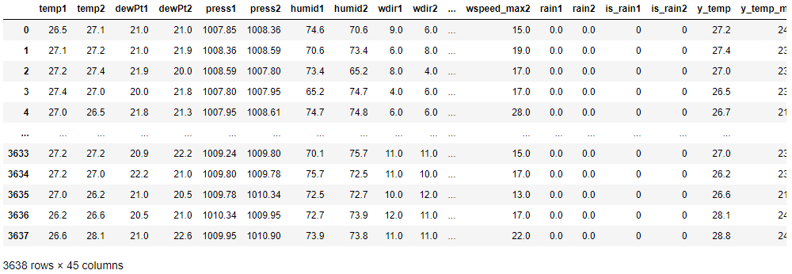
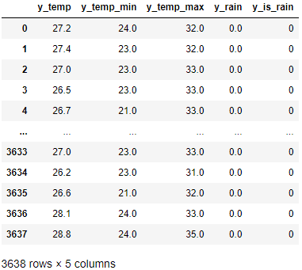
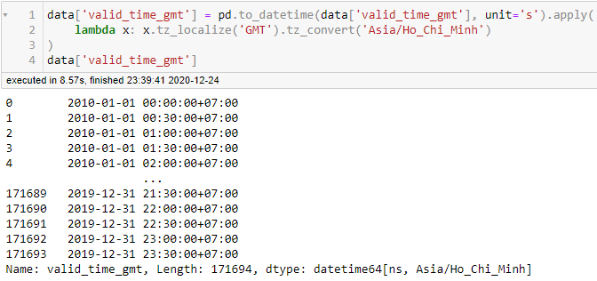

# Đồ án khoa học dữ liệu

<pre>
MSSV: 1712358   Họ và tên: Nguyễn Minh Đức  
MSSV: 1712379   Họ và tên: Đặng Thành Duy
</pre>

Phân công công việc:

# Chủ đề: Dự báo thời tiết

I.  Câu hỏi:

II.  Ý nghĩa:

III.  Cách thức thu thập dữ liệu:
- Chọn https://www.wunderground.com để lấy dữ liệu. Trang này có rất nhiều trạm thời tiết để lấy dữ liệu và độ chính xác khá cao. Ngoài ra có thể crawl api và html nên dữ liệu crawl bằng 2 cách sẽ đồng nhất.
- Dữ liệu được lấy trong 10 năm từ 2010 đến 2020.
- Dữ liệu được lấy từ trạm thời tiết ở sân bay Tân Sơn Nhất(VVTS).

1.  Qua API:
- Do trang API đã đóng cửa từ lâu nên sẽ dùng public api key bằng cách crawl html, search từ khóa apiKey.
- Sau đó sử dụng requests để crawl api thông qua đường dẫn lấy được thông qua browser Devtools>Network>XHR:  
  
  
- Mỗi lần có thể lấy dữ liệu tương ứng với số ngày trong tháng.
- Dữ liệu sẽ được lưu trong ở [data/data.csv](data/data.csv).
- Lấy được tổng cộng 171694 hàng dữ liệu trong 2 phút.

2.   Qua HTML:
- Do trang web sử dụng javascript để render dữ liệu cần lấy nên phải dùng web driver để chạy javascript.
- Đầu tiên sẽ dùng selenium vô trang cần lấy và đổi sang hệ metric:  

- Do thời gian crawl khá lâu nên để tránh các vấn đề có thể xảy ra như rớt mạng..., trước tiên lưu phần html chứa dữ liệu cần lấy ở [data_html/html/](data_html/html/):  

- Do mỗi trang lấy được 1 ngày nên sẽ lưu tên html file bằng ngày để khi chạy lại sẽ không crawl những ngày đã lấy được. 
- Sử dụng mult-threading, mỗi thread sẽ mở 1 browser để tăng tốc độ crawl do trang web load khá lâu khoảng 5-7s. Lấy được tổng công 3644 ngày trong thời gian 55 phút.
- Sau đó rút trích dữ liệu từ các file html đã lấy được bằng BeautifulSoup:  

- Dữ liệu sẽ được lưu trong ở [data_html/data.csv](data_html/data.csv).
- Lấy được tổng cộng 171694 hàng dữ liệu trong 22 phút. Tổng thời gian crawl khoảng 1 giờ 20 phút.

IV.  Tổng quan dữ liệu:
- Dữ liệu có 171694 dòng và 45 cột(ở đây sẽ lấy 8 cột được dùng còn những cột khác do api document không tồn tại nữa nên không biết được):
  - valid_time_gmt(đối với API, còn HTML thì khi lấy đã tạo ngày sẵn 'date'): là epoch time, kiểu dữ liệu int64(1262286000).
  - temp: là nhiệt độ, kiểu dữ liệu là float64(24.0).
  - dewPt: là điểm sương, kiểu dữ liệu là float64(21.0).
  - pressure: là áp suất, kiểu dữ liệu là float64(1008.8).
  - rh: là độ ẩm, kiểu dữ liệu là float64(83.0).
  - wdir_cardinal: là hướng gió, kiểu dữ liệu là object('SE').
  - wspd: là tốc độ gió, kiểu dữ liệu là float64(6.0).
  - wx_phrase: là thời tiết, kiểu dữ liệu là object('Fair').  
  
  
- Dữ liệu sau khi xử lý có 3638 dòng và 45 cột.
  - temp: là nhiệt độ trung bình.
  - dewPt: là điểm sương trung bình.
  - press: là áp suất trung bình.
  - humid: là độ ẩm trung bình.
  - wdir: là hướng gió trung bình.
  - wspeed: là tốc độ gió trung bình.
  - rain: là tỉ lệ mưa trong ngày.
  - is_rain: là ngày hôm đó có mưa hay không.
  - 1 là ngày đầu tiên, 2 là ngày tiếp theo và y_* là các cột của ngày cần dự đoán(ngày thứ 3).  
  
- Cột cần dự đoán là nhiệt độ(y_temp, y_temp_min, y_temp_max), tỉ lệ mưa(y_rain) và có mưa hay không(y_is_rain).  

V.  Tiền xử lý:
- Dữ liệu thời gian sẽ được đưa về datetime và múi giờ Hồ Chí Minh đối với API còn HTML thì chỉ đổi từ 12H sang 24H.  

- Do dữ liệu thời tiết liên tục(30 phút cập nhật một lần), thay đổi khá chậm và dữ liệu thiếu rất ít nên các dữ liệu thiếu sẽ được thay thế bởi dữ liệu gần nó.
- Dữ liệu thuộc tính sẽ đưa về dạng số.
- Cột thời tiết(wx_phrase) sẽ được đổi thành có mưa hoặc không thông qua hàm 'is_rain(weather)'.

- Các hàng dữ liệu sẽ được gom lại theo ngày và lấy max, mean, min. Riêng với cột thời tiết sẽ tính là 1 nếu có 1 lần trong ngày mưa và cột 'rain' là tỉ lệ mưa trong 1 ngày.

VI.  Dự đoán:
- Dữ liệu sẽ chia thành 2: 80% train và 20% test.
-

VII.  Tự đánh giá:

VIII.  Hướng dẫn chạy các file notebook:
1.  Thu thập dữ liệu:
- Mở và run all file Crawl_API nếu muốn crawl api hoặc Crawl_HTML đối với html.
2.  Tiền xử lý:
- Mở và run all file Clean_API nếu muốn tiền xử lý dữ liệu lấy bằng api hoặc Clean_HTML đối với html.
3.  Dự đoán:
- Mở và run all file Predict để train và predict dữ liệu đã thu thập được.
